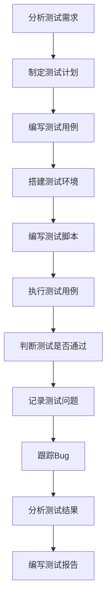

# 第一章：自动化测试基础知识

> 本章建立自动化测试的理论基础，掌握核心概念与基本流程。

## 自动化测试的定义

**自动化测试**是指通过测试工具或脚本来替代人工执行测试用例的过程，实现对软件功能、性能、兼容性等方面的自动化验证。

### 核心特征
- **工具驱动**：通过专门的测试工具执行
- **脚本化**：将测试步骤编写成可执行的脚本
- **重复性**：可多次重复执行相同的测试
- **批量化**：可同时执行大量测试用例

## 自动化测试的优缺点

### 优点

1. **提高测试效率**
    - 减少重复性手工操作时间
    - 支持7×24小时连续执行
    - 可并行执行多个测试环境
2. **提高测试准确性**
    - 消除人为操作错误
    - 确保每次执行的一致性
    - 进行精确的数据验证
3. **降低长期成本**
    - 减少重复性测试的人力投入
    - 缩短测试周期，加快产品发布
    - 提高测试覆盖率
4. **支持复杂场景**
    - 模拟大量用户并发访问
    - 在多种环境下自动执行
    - 快速验证回归功能

### 缺点

1. **初期投入成本高**
    - 购买或开发自动化测试工具
    - 团队学习自动化技术
    - 编写和调试测试脚本
2. **维护成本**
    - 应用变更时需要更新脚本
    - 测试环境的搭建和维护
    - 测试数据的准备和管理
3. **发现缺陷能力有限**
    - 无法进行探索性测试
    - 难以评估用户体验
    - 对复杂业务逻辑理解有限

## 自动化测试的适用场景

- 适合自动化的场景
    - **需求稳定**：功能需求相对固定，不频繁变更
    - **项目周期长**：长期维护的项目，有足够时间投入
    - **重复性高**：需要频繁执行的回归测试
    - **人工难以完成**：大量数据处理、高并发测试
- 不适合自动化的场景
    - **需求频繁变更**：原型阶段的产品
    - **一次性测试**：临时性的测试需求
    - **复杂用户体验**：界面美观性、主观性功能评估

## 自动化测试的分类方式（按测试目的）

- 功能测试自动化
    - **定义**：验证系统功能是否符合需求规格
    - **关注点**：输入输出的正确性
    - **常用工具**：Selenium、Appium、Cypress
- 性能测试自动化
    - **定义**：验证系统在特定负载下的性能表现
    - **关注点**：响应时间、吞吐量、资源使用率
    - **常用工具**：JMeter、LoadRunner、Gatling
- 安全测试自动化
    - **定义**：验证系统的安全防护能力
    - **关注点**：漏洞扫描、权限控制、数据安全
    - **常用工具**：OWASP ZAP、Burp Suite
- 兼容性测试自动化
    - **定义**：验证系统在不同环境下的兼容性
    - **关注点**：跨浏览器、跨平台、跨设备
    - **常用工具**：BrowserStack、Sauce Labs

## 自动化测试的基本流程（11个阶段）

### 完整流程图

点击展开流程图

### 各阶段详解

1. 分析测试需求
    - 理解业务需求和功能规格
    - 确定测试范围和目标
    - 评估自动化的可行性
2. 制定测试计划
    - 确定自动化测试策略
    - 分配测试资源和时间
    - 制定风险应对措施
3. 编写测试用例
    - 设计详细的测试场景
    - 确定测试数据和预期结果
    - 优化用例的可自动化程度
4. 搭建测试环境
    - 准备测试服务器和数据库
    - 配置网络和安全设置
    - 安装必要的测试工具
5. 编写测试脚本
    - 选择合适的自动化框架
    - 编写可重用的测试代码
    - 实现页面对象模式等设计模式
6. 执行测试用例
    - 运行自动化测试脚本
    - 监控测试执行过程
    - 收集测试结果和日志
7. 判断测试是否通过
    - 对比实际结果与预期结果
    - 分析测试失败的原因
    - 确定测试的通过标准
8. 记录测试问题
    - 详细记录发现的缺陷
    - 分类和优先级排序
    - 提供重现步骤和截图
9. 跟踪Bug
    - 与开发团队沟通缺陷
    - 验证修复后的功能
    - 更新缺陷状态
10. 分析测试结果
    - 统计测试覆盖率和通过率
    - 分析测试趋势和质量指标
    - 识别测试中的问题和改进点
11. 编写测试报告
    - 总结测试执行情况
    - 提供质量评估和建议
    - 为决策提供数据支持

## 常用测试工具介绍（至少掌握6个）

### Web自动化测试工具

1. Selenium
    - **类型**：开源
    - **特点**：支持多种浏览器和编程语言，生态完善
    - **适用场景**：Web应用的功能测试
2. Cypress
    - **类型**：开源
    - **特点**：现代化架构，调试友好，执行速度快
    - **适用场景**：现代Web应用的端到端测试
3. Playwright
    - **类型**：开源（Microsoft）
    - **特点**：跨浏览器支持好，API设计优秀
    - **适用场景**：需要跨浏览器测试的现代Web应用

### 移动端自动化测试工具

1. Appium
    - **类型**：开源
    - **特点**：跨平台支持iOS和Android
    - **适用场景**：移动应用的功能测试
2. Espresso（Android）
    - **类型**：Google官方
    - **特点**：Android原生支持，性能优秀
    - **适用场景**：Android应用的UI测试

### 性能测试工具

1. JMeter
    - **类型**：开源
    - **特点**：功能强大，支持多种协议
    - **适用场景**：Web应用性能测试、接口测试
2. LoadRunner
    - **类型**：商业
    - **特点**：企业级性能测试解决方案
    - **适用场景**：大型企业应用性能测试

### 接口测试工具

1. Postman
    - **类型**：商业/免费版
    - **特点**：易用的API测试工具
    - **适用场景**：REST API接口测试
2. SoapUI
    - **类型**：开源/商业版
    - **特点**：支持SOAP和REST接口
    - **适用场景**：Web服务接口测试

### 持续集成工具

1. Jenkins
    - **类型**：开源
    - **特点**：强大的CI/CD平台
    - **适用场景**：自动化测试的持续集成