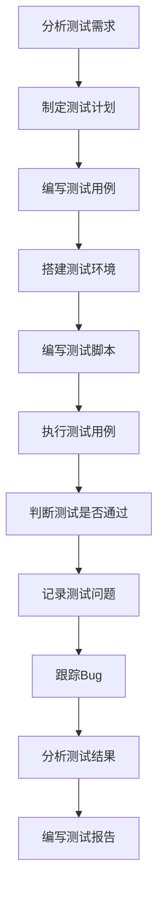

# 自动化测试的基本流程

## 完整流程图

点击展开流程图

## 各阶段详解

1. 分析测试需求
    - 理解业务需求和功能规格
    - 确定测试范围和目标
    - 评估自动化的可行性
2. 制定测试计划
    - 确定自动化测试策略
    - 分配测试资源和时间
    - 制定风险应对措施
3. 编写测试用例
    - 设计详细的测试场景
    - 确定测试数据和预期结果
    - 优化用例的可自动化程度
4. 搭建测试环境
    - 准备测试服务器和数据库
    - 配置网络和安全设置
    - 安装必要的测试工具
5. 编写测试脚本
    - 选择合适的自动化框架
    - 编写可重用的测试代码
    - 实现页面对象模式等设计模式
6. 执行测试用例
    - 运行自动化测试脚本
    - 监控测试执行过程
    - 收集测试结果和日志
7. 判断测试是否通过
    - 对比实际结果与预期结果
    - 分析测试失败的原因
    - 确定测试的通过标准
8. 记录测试问题
    - 详细记录发现的缺陷
    - 分类和优先级排序
    - 提供重现步骤和截图
9. 跟踪Bug
    - 与开发团队沟通缺陷
    - 验证修复后的功能
    - 更新缺陷状态
10. 分析测试结果
    - 统计测试覆盖率和通过率
    - 分析测试趋势和质量指标
    - 识别测试中的问题和改进点
11. 编写测试报告
    - 总结测试执行情况
    - 提供质量评估和建议
    - 为决策提供数据支持