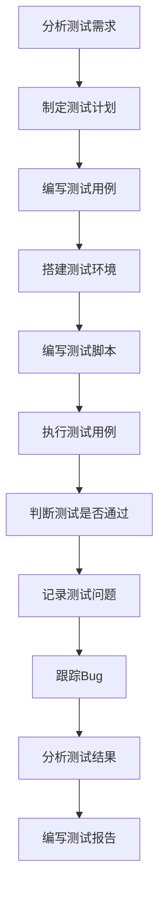

# 自动化测试基本流程与工具概览

> 本节介绍一个成熟的自动化测试过程遵循的系统化生命周期，以确保其有效性和可持续性。

## 自动化测试的11阶段流程

一个成熟的自动化测试过程遵循系统化的生命周期，以确保其有效性和可持续性：

### 完整流程图

### 各阶段详解

**1. 分析测试需求**
- 理解需要自动化的功能和业务场景
- 确定测试范围和目标
- 评估自动化的可行性和必要性

**2. 制定测试计划**
- 规划自动化测试的范围、资源和时间表
- 确定自动化测试策略和方法
- 制定风险应对措施

**3. 编写测试用例**
- 设计详细的自动化测试用例
- 确定测试数据和预期结果
- 优化用例的可自动化程度

**4. 搭建测试环境**
- 准备测试所需的硬件、软件和网络环境
- 配置测试服务器和数据库
- 安装必要的测试工具和驱动程序

**5. 编写测试脚本**
- 将测试用例转化为可执行的自动化脚本
- 选择合适的自动化框架和工具
- 实现页面对象模式等设计模式

**6. 执行测试用例**
- 运行自动化脚本
- 监控测试执行过程
- 收集测试结果和日志

**7. 判断测试是否通过**
- 通过断言来验证实际结果与预期结果
- 对比实际结果与预期结果
- 确定测试的通过标准

**8. 记录测试问题**
- 记录失败的测试和发现的缺陷
- 详细记录发现的缺陷，分类和优先级排序
- 提供重现步骤和截图

**9. 跟踪Bug**
- 在缺陷管理系统中跟踪问题的修复过程
- 与开发团队沟通缺陷
- 验证修复后的功能

**10. 分析测试结果**
- 分析测试覆盖率、通过率等指标
- 统计测试覆盖率和通过率
- 识别测试中的问题和改进点

**11. 编写测试报告**
- 总结测试活动并输出最终报告
- 提供质量评估和建议
- 为决策提供数据支持

## 常用自动化测试工具

### Web自动化测试工具

**Selenium**
- **类型**：开源的Web UI自动化测试框架
- **特点**：是行业事实上的标准，支持多种浏览器和编程语言
- **适用场景**：Web应用的功能测试

### 移动端自动化测试工具

**Appium**
- **类型**：开源的移动端（iOS/Android）App自动化测试工具
- **特点**：跨平台支持，使用WebDriver协议
- **适用场景**：移动应用的功能测试

### 性能测试工具

**JMeter**
- **类型**：由Apache开发的开源工具
- **特点**：主要用于性能/负载测试和接口测试
- **适用场景**：Web应用性能测试、API测试