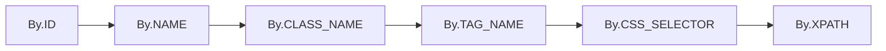

# 第二章：Selenium WebDriver 基本应用

> 本章详细介绍Selenium WebDriver的基础使用方法，掌握Web自动化测试的核心技能。

## 环境搭建

### 环境准备步骤

1. 安装Python
     ```bash
     # 下载并安装Python（建议3.8+版本）
     # 安装时务必勾选"Add Python to PATH"
     python --version  # 验证安装
     ```
2. 安装Selenium库
     ```bash
     # 使用pip安装Selenium
     pip install selenium
 
     # 验证安装
     python -c "import selenium; print(selenium.__version__)"
     ```
3. 下载浏览器驱动
     - **Chrome浏览器**：下载 [ChromeDriver](https://chromedriver.chromium.org/)
     - **Firefox浏览器**：下载 [GeckoDriver](https://github.com/mozilla/geckodriver/releases)  
     - **Edge浏览器**：下载 [EdgeDriver](https://developer.microsoft.com/en-us/microsoft-edge/tools/webdriver/)
4. 配置驱动路径
     ```python
     # 方法1：将驱动放在Python Scripts目录
     # 方法2：添加到系统PATH环境变量
     # 方法3：代码中指定路径
     from selenium import webdriver
     
     driver = webdriver.Chrome("/path/to/chromedriver")
     ```
5. 自动管理驱动（推荐）
     ```bash
     # 安装webdriver-manager
     pip install webdriver-manager
     ```

     ```python
     from selenium import webdriver
     from webdriver_manager.chrome import ChromeDriverManager
     
     # 自动下载和管理ChromeDriver
     driver = webdriver.Chrome(ChromeDriverManager().install())
     ```

## 元素定位方法（6种核心方法）

### 定位策略优先级


1. By.ID（最优）
     ```python
     from selenium import webdriver
     from selenium.webdriver.common.by import By
 
     driver = webdriver.Chrome()
     element = driver.find_element(By.ID, "username")
     ```
     
     **特点**：
     
     - ✅ 性能最佳，唯一性最好
     - ✅ 稳定性高，不易受页面结构变化影响
     - 💡 应优先使用，当元素有唯一ID时

2. By.NAME
     ```python
     element = driver.find_element(By.NAME, "password")
     ```

     **特点**：

     - ✅ 常用于表单元素
     - ✅ 性能较好
     - ⚠️ 不保证唯一性

3. By.CLASS_NAME
     ```python
     element = driver.find_element(By.CLASS_NAME, "login-button")
     ```

     **特点**：
     
     - ✅ 与CSS样式相关，相对稳定
     - ⚠️ 可能存在多个相同class的元素
     - ⚠️ 只能指定单个class名，不能使用组合class

4. By.TAG_NAME
     ```python
     # 获取页面中所有的链接
     links = driver.find_elements(By.TAG_NAME, "a")
     ```

     **特点**：
     
     - ✅ 简单直接
     - ❌ 通常匹配多个元素，很少用于精确定位
     - 💡 常用于获取一组同类型元素

5. By.CSS_SELECTOR（推荐）
     ```python
     # 基本选择器
     element = driver.find_element(By.CSS_SELECTOR, "#username")    # ID选择器
     element = driver.find_element(By.CSS_SELECTOR, ".login-btn")   # class选择器
     element = driver.find_element(By.CSS_SELECTOR, "input[name='password']")  # 属性选择器

     # 组合选择器
     element = driver.find_element(By.CSS_SELECTOR, "form .login-btn")  # 后代选择器
     element = driver.find_element(By.CSS_SELECTOR, "input:nth-child(2)")  # 伪类选择器
     ```

     **特点**：

     - ✅ 性能优于XPath
     - ✅ 语法简洁，功能强大
     - ✅ 支持复杂的选择逻辑

6. By.XPATH（最强大但慎用）
     ```python
     # 相对路径（推荐）
     element = driver.find_element(By.XPATH, "//input[@id='username']")
     element = driver.find_element(By.XPATH, "//button[contains(text(),'登录')]")
     element = driver.find_element(By.XPATH, "//div[@class='error' and contains(text(),'密码')]")

     # 轴定位
     element = driver.find_element(By.XPATH, "//label[text()='用户名']/following-sibling::input")
     ```

     **特点**：

     - ✅ 功能最强大，几乎可以定位任何元素
     - ✅ 支持文本内容定位
     - ❌ 性能最差，对页面结构变化最敏感

### 定位方法选择指南

| 场景     | 推荐策略        | 示例                                              |
| -------- | --------------- | ------------------------------------------------- |
| 有唯一ID | By.ID           | `By.ID, "submit-btn"`                             |
| 表单控件 | By.NAME         | `By.NAME, "username"`                             |
| 样式相关 | By.CSS_SELECTOR | `By.CSS_SELECTOR, ".btn-primary"`                 |
| 复杂结构 | By.CSS_SELECTOR | `By.CSS_SELECTOR, "form .row:nth-child(2) input"` |
| 文本定位 | By.XPATH        | `By.XPATH, "//button[text()='提交']"`             |

## 元素操作

### 输入和清除操作

#### .send_keys() - 输入文本
```python
# 基本输入
username_field = driver.find_element(By.ID, "username")
username_field.send_keys("testuser")

# 特殊按键输入
from selenium.webdriver.common.keys import Keys

search_box = driver.find_element(By.NAME, "q")
search_box.send_keys("selenium")
search_box.send_keys(Keys.RETURN)  # 回车键

# 组合键
search_box.send_keys(Keys.CONTROL, "a")  # Ctrl+A全选
search_box.send_keys(Keys.CONTROL, "c")  # Ctrl+C复制
```

#### .clear() - 清除文本
```python
password_field = driver.find_element(By.ID, "password")
password_field.clear()  # 清除现有内容
password_field.send_keys("newpassword")
```

### 获取元素信息

#### 获取属性
```python
element = driver.find_element(By.ID, "submit-btn")

# 获取属性值
class_name = element.get_attribute("class")
href = element.get_attribute("href")
value = element.get_attribute("value")
```

#### 获取文本
```python
# 获取元素文本内容
text_content = element.text

# 获取innerHTML
inner_html = element.get_attribute("innerHTML")
```

#### 获取尺寸和位置
```python
# 获取元素尺寸
size = element.size
width = size['width']
height = size['height']

# 获取元素位置
location = element.location
x = location['x']
y = location['y']
```

### 鼠标操作
```python
from selenium.webdriver.common.action_chains import ActionChains

actions = ActionChains(driver)

# 点击
element = driver.find_element(By.ID, "button")
actions.click(element).perform()

# 双击
actions.double_click(element).perform()

# 右键点击
actions.context_click(element).perform()

# 悬停
actions.move_to_element(element).perform()

# 拖动
source = driver.find_element(By.ID, "source")
target = driver.find_element(By.ID, "target")
actions.drag_and_drop(source, target).perform()
```

### 键盘操作
```python
from selenium.webdriver.common.keys import Keys

element = driver.find_element(By.ID, "input")

# 常用键盘操作
element.send_keys(Keys.ENTER)     # 回车
element.send_keys(Keys.TAB)       # Tab键
element.send_keys(Keys.ESCAPE)    # Esc键
element.send_keys(Keys.SPACE)     # 空格键

# 组合键
element.send_keys(Keys.CONTROL, "a")  # Ctrl+A
element.send_keys(Keys.CONTROL, "c")  # Ctrl+C
element.send_keys(Keys.CONTROL, "v")  # Ctrl+V
```

## 浏览器控制

### 页面导航
```python
# 打开页面
driver.get("https://www.example.com")

# 刷新页面
driver.refresh()

# 前进
driver.forward()

# 后退
driver.back()

# 关闭当前窗口
driver.close()

# 关闭浏览器
driver.quit()
```

### 窗口管理
```python
# 最大化窗口
driver.maximize_window()

# 最小化窗口
driver.minimize_window()

# 设置窗口尺寸
driver.set_window_size(1024, 768)

# 设置窗口位置
driver.set_window_position(100, 100)

# 获取窗口句柄
current_handle = driver.current_window_handle
all_handles = driver.window_handles

# 切换窗口
driver.switch_to.window(all_handles[1])
```

### 截图功能
```python
# 截取整个页面
driver.save_screenshot("page_screenshot.png")

# 截取特定元素
element = driver.find_element(By.ID, "content")
element.screenshot("element_screenshot.png")
```

### 获取页面信息
```python
# 获取页面标题
title = driver.title

# 获取当前URL
current_url = driver.current_url

# 获取页面源码
page_source = driver.page_source
```