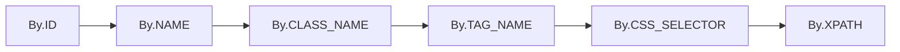

# 元素定位方法

> 本节详细介绍Selenium WebDriver的6种核心元素定位方法及使用策略。

## 定位策略优先级


## 6种核心定位方法

### 1. By.ID（最优）
```python
from selenium import webdriver
from selenium.webdriver.common.by import By

driver = webdriver.Chrome()
element = driver.find_element(By.ID, "username")
```

**特点**：

- ✅ 性能最佳，唯一性最好
- ✅ 稳定性高，不易受页面结构变化影响
- 💡 应优先使用，当元素有唯一ID时

### 2. By.NAME
```python
element = driver.find_element(By.NAME, "password")
```

**特点**：

- ✅ 常用于表单元素
- ✅ 性能较好
- ⚠️ 不保证唯一性

### 3. By.CLASS_NAME
```python
element = driver.find_element(By.CLASS_NAME, "login-button")
```

**特点**：

- ✅ 与CSS样式相关，相对稳定
- ⚠️ 可能存在多个相同class的元素
- ⚠️ 只能指定单个class名，不能使用组合class

### 4. By.TAG_NAME
```python
# 获取页面中所有的链接
links = driver.find_elements(By.TAG_NAME, "a")
```

**特点**：

- ✅ 简单直接
- ❌ 通常匹配多个元素，很少用于精确定位
- 💡 常用于获取一组同类型元素

### 5. By.CSS_SELECTOR（推荐）
```python
# 基本选择器
element = driver.find_element(By.CSS_SELECTOR, "#username")    # ID选择器
element = driver.find_element(By.CSS_SELECTOR, ".login-btn")   # class选择器
element = driver.find_element(By.CSS_SELECTOR, "input[name='password']")  # 属性选择器

# 组合选择器
element = driver.find_element(By.CSS_SELECTOR, "form .login-btn")  # 后代选择器
element = driver.find_element(By.CSS_SELECTOR, "input:nth-child(2)")  # 伪类选择器
```

**特点**：

- ✅ 性能优于XPath
- ✅ 语法简洁，功能强大
- ✅ 支持复杂的选择逻辑

### 6. By.XPATH（最强大但慎用）
```python
# 相对路径（推荐）
element = driver.find_element(By.XPATH, "//input[@id='username']")
element = driver.find_element(By.XPATH, "//button[contains(text(),'登录')]")
element = driver.find_element(By.XPATH, "//div[@class='error' and contains(text(),'密码')]")

# 轴定位
element = driver.find_element(By.XPATH, "//label[text()='用户名']/following-sibling::input")
```

**特点**：

- ✅ 功能最强大，几乎可以定位任何元素
- ✅ 支持文本内容定位
- ❌ 性能最差，对页面结构变化最敏感

## 定位方法选择指南

| 场景     | 推荐策略        | 示例                                              |
| -------- | --------------- | ------------------------------------------------- |
| 有唯一ID | By.ID           | `By.ID, "submit-btn"`                             |
| 表单控件 | By.NAME         | `By.NAME, "username"`                             |
| 样式相关 | By.CSS_SELECTOR | `By.CSS_SELECTOR, ".btn-primary"`                 |
| 复杂结构 | By.CSS_SELECTOR | `By.CSS_SELECTOR, "form .row:nth-child(2) input"` |
| 文本定位 | By.XPATH        | `By.XPATH, "//button[text()='提交']"`             | 