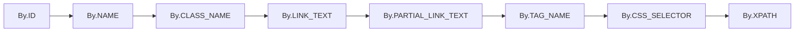

# 交互之核：八大元素定位策略详解

> Selenium通过不同的策略来查找页面上的元素，以便进行交互。选择何种定位策略，直接影响到脚本的稳定性、可读性和执行效率。

## 定位策略发展

从旧版的`find_element_by_*`方法演进至今，官方推荐使用更统一的`find_element(By.*, ...)`语法。

```python
# 旧版写法（已废弃）
driver.find_element_by_id("username")

# 新版推荐写法
from selenium.webdriver.common.by import By
driver.find_element(By.ID, "username")
```

## 八大元素定位策略详解

### 策略优先级原则

选择定位策略的决策过程应遵循从上至下的优先级。优先使用ID，因为它最稳定、最快。当ID不可用时，考虑使用Name或CSS Selector。XPath因其脆弱性，应尽量避免使用，除非别无选择。
<details>
<summary>📊 定位策略优先级流程图（点击展开）</summary>



</details>

### 1. By.ID（最优策略）

```python
from selenium import webdriver
from selenium.webdriver.common.by import By

driver = webdriver.Chrome()
element = driver.find_element(By.ID, "element-id")
```

| 性能与可靠性                                    | 最佳使用场景                               |
| ----------------------------------------------- | ------------------------------------------ |
| 最快且最可靠。W3C标准规定ID在页面中必须是唯一的 | 元素拥有唯一且静态的ID属性时，这是首选策略 |

### 2. By.NAME

```python
element = driver.find_element(By.NAME, "element-name")
```

| 性能与可靠性                               | 最佳使用场景                                                           |
| ------------------------------------------ | ---------------------------------------------------------------------- |
| 良好。通常用于定位表单元素，但不保证唯一性 | 主要用于定位表单中的输入框、复选框等，当ID不可用时是一个很好的替代方案 |

### 3. By.CLASS_NAME

```python
element = driver.find_element(By.CLASS_NAME, "class-name")
```

| 性能与可靠性                                                               | 最佳使用场景                                                         |
| -------------------------------------------------------------------------- | -------------------------------------------------------------------- |
| 良好。但一个元素可以有多个class，且一个class可以被多个元素使用，不保证唯一 | 用于通过CSS类名定位。如果类名不唯一，应使用find_elements获取一组元素 |

### 4. By.LINK_TEXT

```python
element = driver.find_element(By.LINK_TEXT, "完整的链接文本")
```

| 性能与可靠性           | 最佳使用场景                                                       |
| ---------------------- | ------------------------------------------------------------------ |
| 可靠，但对文本变化敏感 | 精确匹配`<a>`标签的可见文本。例如，定位一个文本为"Downloads"的链接 |

### 5. By.PARTIAL_LINK_TEXT

```python
element = driver.find_element(By.PARTIAL_LINK_TEXT, "部分文本")
```

| 性能与可靠性                             | 最佳使用场景                                                    |
| ---------------------------------------- | --------------------------------------------------------------- |
| 灵活，但可能匹配到多个元素，存在不确定性 | 模糊匹配`<a>`标签的可见文本。适用于链接文本较长或动态变化的场景 |

### 6. By.TAG_NAME

```python
# 获取页面中所有的链接
links = driver.find_elements(By.TAG_NAME, "a")
```

| 性能与可靠性                         | 最佳使用场景                                                               |
| ------------------------------------ | -------------------------------------------------------------------------- |
| 速度快，但通常不用于精确定位单个元素 | 主要用于获取页面上某一类型的所有元素，例如获取所有的`<a>`标签或``标签 |

### 7. By.CSS_SELECTOR（推荐）

```python
# 基本选择器
element = driver.find_element(By.CSS_SELECTOR, "#id.class[attr='value']")

# ID选择器
element = driver.find_element(By.CSS_SELECTOR, "#username")

# class选择器
element = driver.find_element(By.CSS_SELECTOR, ".login-btn")

# 属性选择器
element = driver.find_element(By.CSS_SELECTOR, "input[name='password']")

# 组合选择器
element = driver.find_element(By.CSS_SELECTOR, "form .login-btn")
element = driver.find_element(By.CSS_SELECTOR, "input:nth-child(2)")
```

| 性能与可靠性                      | 最佳使用场景                                                               |
| --------------------------------- | -------------------------------------------------------------------------- |
| 性能优于XPath，非常可靠，语法灵活 | 功能强大，是定位复杂元素时的推荐选择，在性能和语法灵活性之间取得了最佳平衡 |

### 8. By.XPATH（最强大但慎用）

```python
# 相对路径（推荐）
element = driver.find_element(By.XPATH, "//tag[@attr='value']")
element = driver.find_element(By.XPATH, "//input[@id='username']")
element = driver.find_element(By.XPATH, "//button[contains(text(),'登录')]")
element = driver.find_element(By.XPATH, "//div[@class='error' and contains(text(),'密码')]")

# 轴定位
element = driver.find_element(By.XPATH, "//label[text()='用户名']/following-sibling::input")
```

| 性能与可靠性                                                                     | 最佳使用场景                                                                                    |
| -------------------------------------------------------------------------------- | ----------------------------------------------------------------------------------------------- |
| 功能最强大，几乎可以定位任何元素，但通常最慢，且对页面结构变化非常敏感，最为脆弱 | 作为最后手段使用。当其他所有方法都无法定位时，或需要通过文本内容、复杂的父子/兄弟关系定位时使用 |

## 定位方法选择指南

| 场景     | 推荐策略        | 示例                                              |
| -------- | --------------- | ------------------------------------------------- |
| 有唯一ID | By.ID           | `By.ID, "submit-btn"`                             |
| 表单控件 | By.NAME         | `By.NAME, "username"`                             |
| 样式相关 | By.CSS_SELECTOR | `By.CSS_SELECTOR, ".btn-primary"`                 |
| 复杂结构 | By.CSS_SELECTOR | `By.CSS_SELECTOR, "form .row:nth-child(2) input"` |
| 文本定位 | By.XPATH        | `By.XPATH, "//button[text()='提交']"`             |

## 层次化选择方法

这种层次化的选择方法，是编写高质量、易维护自动化脚本的关键：

1. **优先使用ID**：因为它最稳定、最快
2. **其次考虑Name**：特别是表单元素
3. **然后是CSS Selector**：性能和灵活性的平衡
4. **最后才是XPath**：功能强大但脆弱，除非别无选择

## 实用示例

```python
from selenium import webdriver
from selenium.webdriver.common.by import By

def demonstrate_locators():
    """演示各种定位策略的使用"""
    driver = webdriver.Chrome()
    driver.get("https://example.com")
    
    try:
        # 1. ID定位（首选）
        username = driver.find_element(By.ID, "username")
        
        # 2. Name定位
        password = driver.find_element(By.NAME, "password")
        
        # 3. CSS选择器定位
        submit_btn = driver.find_element(By.CSS_SELECTOR, ".btn-primary")
        
        # 4. XPath定位（最后选择）
        error_msg = driver.find_element(By.XPATH, "//div[contains(@class, 'error')]")
        
        print("✅ 所有元素定位成功")
        
    except Exception as e:
        print(f"❌ 元素定位失败：{e}")
    finally:
        driver.quit()
``` 